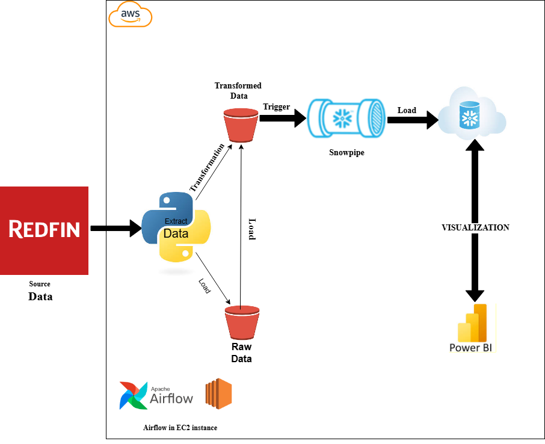

# Redfin-Data-Analysis-ETL-
## Overview

This project implements a robust data analysis pipeline for real estate data sourced from Redfin. Utilizing a combination of Python, Apache Airflow, AWS S3, Snowpipe, and Power BI, the pipeline automates the extraction, transformation, and loading (ETL) of data, enabling insightful visualizations and analytics.

## Project Structure

## Technologies Used
- **Python:** For scripting the ETL processes.
- **Apache Airflow:** For orchestrating and scheduling the ETL pipeline.
- **AWS S3:** For storing both raw and transformed data.
- **Snowflake:** For cloud-based data warehousing and real-time data loading using Snowpipe.
- **Power BI:** For creating visualizations and dashboards from the processed data.

## Workflow
1- **Data Extraction:**

- The pipeline extracts real estate data from Redfin using a specified API or data URL.
- The data is initially stored in a raw format in an AWS S3 bucket.

2- **Data Transformation:**

- The extracted data is processed using Python and Pandas:
    - Cleaning and formatting the data (e.g., removing unwanted characters).
    - Selecting relevant columns and handling missing values.
    - Converting date fields to appropriate formats and extracting additional time-related information.

3- **Data Loading:**

- The transformed data is saved as CSV files and uploaded to a designated S3 bucket.
- Snowpipe is configured to automatically ingest the data from S3 into Snowflake for further analysis.

4- **Data Visualization:**

- Power BI connects to the Snowflake data warehouse to create interactive dashboards and reports, providing insights into real estate trends and metrics.

## Prerequisites
- Python 3.x
- Apache Airflow
- AWS account with S3 access
- Snowflake account
- Power BI

## Output
The transformed data includes key metrics such as:

- **period_begin:** Start date of the reporting period.
- **period_end:** End date of the reporting period.
- **city:** Name of the city.
- **state:** State abbreviation.
- **median_sale_price:** Median sale price of homes.
- **homes_sold:** Number of homes sold during the period.
- **inventory:** Number of active listings.

## Conclusion
This project serves as a practical example of building a scalable data pipeline for real estate analytics using modern data engineering tools. By following this guide, you can gain valuable insights into the real estate market and enhance your data engineering skills.

## License
This project is licensed under the MIT License. See the LICENSE file for details.